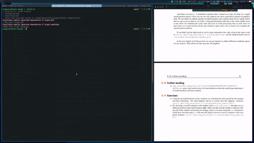

# Learning OpenGL with C++, GLFW, and GLAD

This is a repo for my journey in learning graphics programming using C++, GLFW3 and OpenGL through the tutorials provided in Learn OpenGL and other sources.

# Learning Sources

[OpenGL Docs](https://docs.gl/) - Concise documentation for OpenGL functions and methods.

[Learn OpenGL](https://learnopengl.com/) - Free OpenGL Online Tutorial/PDF book.

[YouTube - freeCodeCamp OpenGL Crash Course](https://www.youtube.com/watch?v=45MIykWJ-C4&t) - Free Crash Course into
the basics of OpenGL provided by freeCodeCamp.

[YouTube - OpenGL Playlist - by The Cherno](https://www.youtube.com/playlist?list=PLlrATfBNZ98foTJPJ_Ev03o2oq3-GGOS2) - YouTube playlist series by the Cherno who's worked in the game industry for a few years.

[YouTube - OpenGL Tutorial Playlist - by Victor Gordan](https://www.youtube.com/playlist?list=PLPaoO-vpZnumdcb4tZc4x5Q-v7CkrQ6M-) - YouTube playlist series by Victor Gordan who follows along the learning resources provided in the Learn OpenGL book provided
above.

# Completed Chapter Snippets

###Chapter 8 Transformation - Exercise:

###Chapter 9 3D!!

